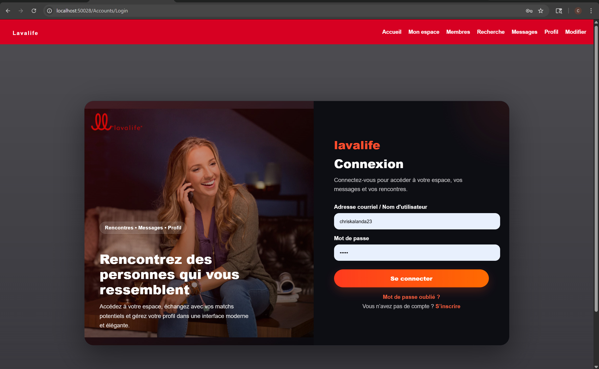
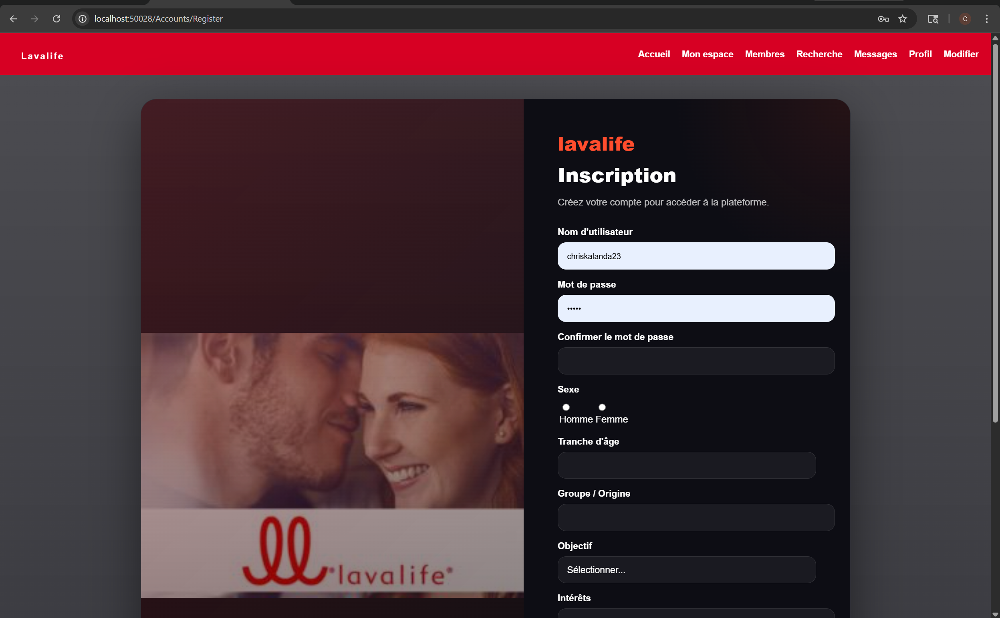
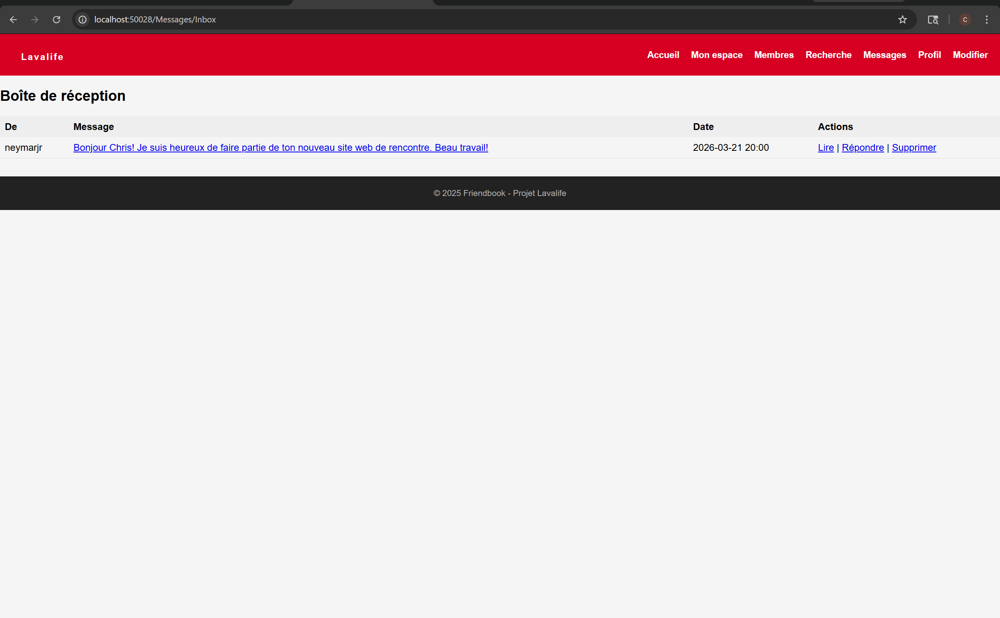
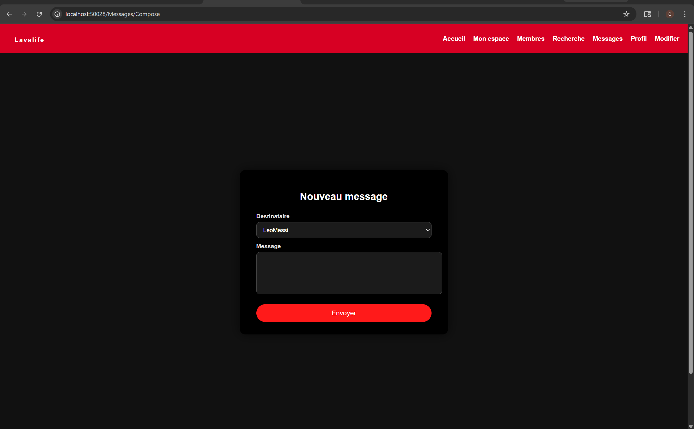

# ❤️ Lavalife Web App (Friendbook Clone)

A modern dating-style web application inspired by Lavalife, built with ASP.NET WebForms.

This project allows users to create profiles, connect with others, and exchange messages in a clean and responsive interface.

---

## 🚀 Features

* 🔐 User registration and login system
* 👤 Profile creation and management
* 💬 Messaging system between users
* 🔍 Search/filter users by:

  * Gender
  * Age group
  * Interests
* 🎨 Premium modern UI (dark theme)
* 📱 Responsive design (mobile-friendly)

---

## 🛠️ Tech Stack

* ASP.NET WebForms (C#)
* SQL Server / LocalDB
* HTML5 / CSS3
* Bootstrap
* jQuery

---

## 🗄️ Database Setup

To run the project locally:

1. Open **SQL Server Management Studio**
2. Create a new database (e.g., `FriendbookDB`)
3. Run the script:

```
/Database/FriendbookDB-setup.sql
```

4. Verify the connection string in `Web.config`
5. Run the project in Visual Studio

---

## ⚠️ Notes

* This is an academic project
* Passwords are stored without hashing for simplicity
  (⚠️ In production, secure hashing like bcrypt should be used)

---

## 📸 Application Preview

### 🔐 Login


### 📝 Register


### 💬 Messaging Inbox


### ✉️ Compose Message


---

## 📦 Project Structure

```
lavaCloneWF/
│
├── Accounts/        # Login & Register pages
├── Content/         # CSS / UI styles
├── Scripts/         # JavaScript
├── Database/        # SQL setup script
├── App_Data/        # (ignored in Git)
└── Web.config
```

---

## 👨‍💻 Author

**Chris Kalanda**
Junior Full-Stack Developer

---

## 💡 Future Improvements

* 🔒 Password hashing (bcrypt)
* 📸 Profile picture upload
* ❤️ Match system
* 🔔 Real-time notifications
* 🌐 Multi-language support (FR / EN)

---

## ⭐ GitHub

If you like this project, feel free to ⭐ the repository!
